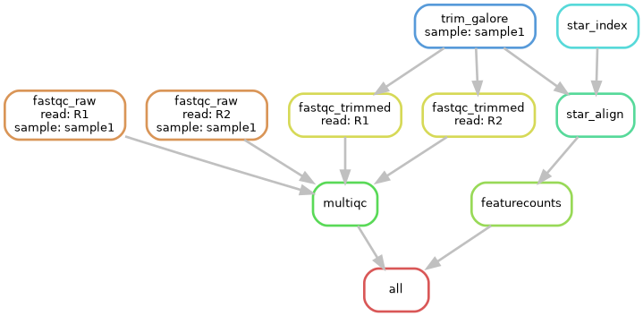

# RNA-seq Snakemake Pipeline

End-to-end RNA-seq pipeline implemented using Snakemake with
rule-specific conda environments.

## Workflow
- FastQC (raw & trimmed)
- Adapter trimming (Trim Galore)
- STAR alignment
- Gene quantification (featureCounts)
- MultiQC reporting

## Workflow DAG



## Requirements
- Linux / WSL
- Conda or Mamba
- Snakemake ≥ 7

## Usage
```bash
snakemake --use-conda --cores 8
```

## Configuration
Edit `config.yaml` to set:
- sample directory
- library type (paired / stranded)
- GTF annotation
- genome paths

## Tested On
- Mouse RNA-seq (paired-end)
- Public SRA datasets
